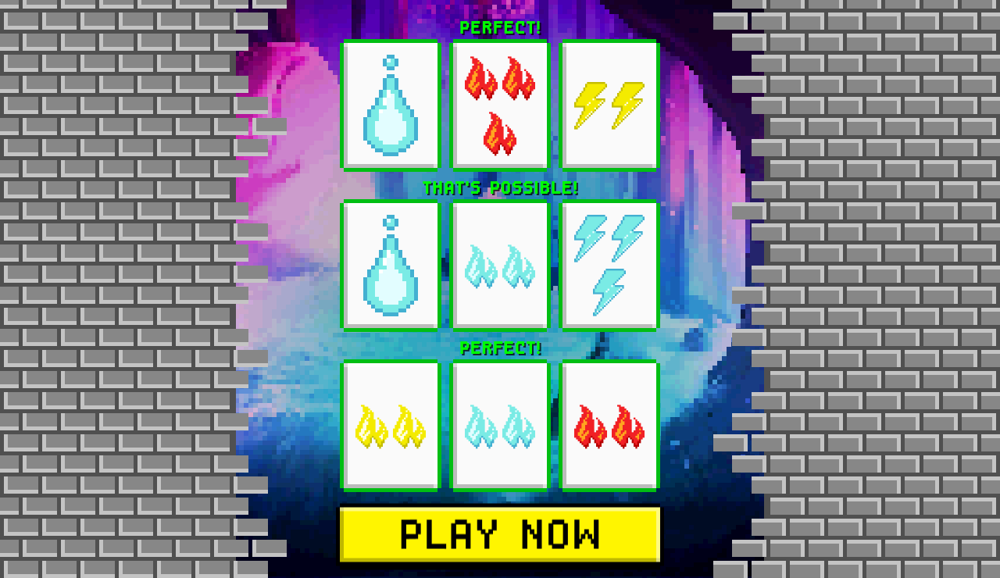
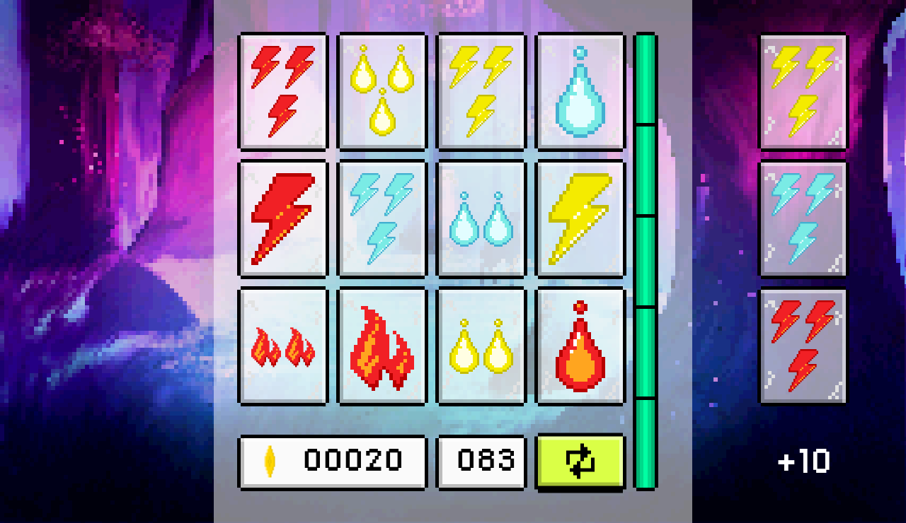

# elematch

Get points by finding card sets.

[Play Now](https://elemat.ch)

## Screenshots

- 
- 

## Tooling

- [Vite](https://vite.dev/) for bundling and the dev server.
- [Phaser 3](https://phaser.io/) game framework.
- [pnpm](https://pnpm.io/) as the package manager (enable with `corepack enable`).
- [Vitest](https://vitest.dev/) for unit tests.
- Node.js 24 LTS (see `.nvmrc`).

## Build/Run

Install dependencies
```bash
git clone git@github.com:elematch/elematch.git
cd elematch
pnpm install
```

Run the development server
```bash
pnpm dev
```

Build the project (output in `dist/`)
```bash
pnpm build
```

Run the tests
```bash
pnpm test
```

## Deploy (Cloudflare Workers)

The site is deployed as a static-assets Worker named `elemat-ch` (see `wrangler.jsonc`).

```bash
pnpm deploy            # builds, then runs `wrangler deploy`
```

Authenticate first with `wrangler login` if you have not already.

### Docker

Build the docker image
```bash
git clone git@github.com:elematch/elematch.git
cd elematch
docker build -t elematch .
```
Run the container
```bash
docker run -d -p 80:80 elematch
```
